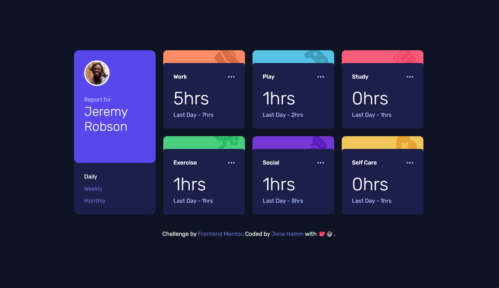

# 🌐 Frontend Mentor - Time tracking dashboard solution

This is my solution for the [Time tracking dashboard challenge on Frontend Mentor](https://www.frontendmentor.io/challenges/time-tracking-dashboard-UIQ7167Jw). Frontend Mentor challenges help you improve your coding skills by building realistic projects.

---

## 📋 Table of contents

- [Overview](#-overview)
  - [Features](#-features)
  - [Preview](#-preview)
  - [Links](#-links)
- [My process](#-my-process)
  - [Built with](#-built-with)
  - [What I learned](#-what-i-learned)
- [Development Workflow](#-development-workflow)
- [Useful Resources](#-useful-resources)
- [Author](#-author)
- [Acknowledgments](#-acknowledgments)

---

## 🌍 Overview

### ✨ Features

A responsive time-tracking dashboard that lets users switch between daily, weekly, and monthly views, featuring smooth count-up animations for dynamic data updates.

### 🖼️ Preview



### 🔗 Links

- 💡 Solution URL: [Frontend Mentor Submission](https://www.frontendmentor.io/solutions/time-tracking-dashboard-with-css-and-js--ILcrhpYBP)
- 🌐 Live Site URL: [Live Demo](https://thewizard04-time-tracking-dashboard.vercel.app)

---

## 🛠️ My process

### 🧰 Built with

| Category  | Tools                     |
| --------- | ------------------------- |
| Structure | **Semantic HTML5 markup** |
| Styles    | **CSS**                   |
| Logic     | **JavaScript**            |

### 🧠 What I learned

- Improved my understanding of semantic HTML5 markup
- Strengthened my styling skills using CSS
- Improved my knowledge and skills with JavaScript

Here is the snippet for the counter animation:

```js
const countTo = (el, target) => {
  if (el.animationId) cancelAnimationFrame(el.animationId);

  const start = performance.now();
  const duration = Math.min(1800, Math.max(800, target * 30));

  function tick(now) {
    const progress = Math.min((now - start) / duration, 1);
    const eased = 1 - Math.pow(1 - progress, 3);

    const value = Math.floor(eased * target);
    el.textContent = `${value}hrs`;

    if (progress < 1) {
      el.animationId = requestAnimationFrame(tick);
    }
  }

  el.animationId = requestAnimationFrame(tick);
};
```

---

## 🧩 Development Workflow

### 🧱 Local Setup

1. **Start using CSS in your HTML**

   ```html
   <link rel="stylesheet" href="styles.css.css" />
   ```

2. Then open your index.html file in the browser.

---

## 📖 Useful Resources

- [MDN Web Docs](https://developer.mozilla.org/) – Trusted documentation and guides for modern web technologies.
- [W3Schools](https://www.w3schools.com/) – Easy-to-follow tutorials and references for learning web development.
- [RequestAnimationFrame](https://developer.mozilla.org/en-US/docs/Web/API/Window/requestAnimationFrame) - Link to the MDN web Docs about the requestAnimationFrame method

---

## 👨‍💻 Author

- GitHub - [Jona Hamm](https://github.com/CrazyWizard04)
- Frontend Mentor - [@CrazyWizard04](https://www.frontendmentor.io/profile/crazywizard04)

---

## 💖 Acknowledgments

A big thanks to **Frontend Mentor** for providing this project.
Their challenges are a great way for developers of all levels to practice, learn, and improve their skills through real-world examples.

Thank you <3
